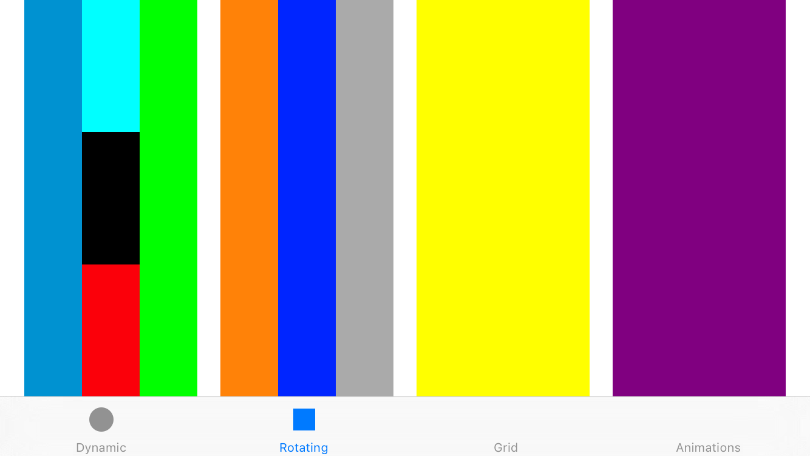

# UIStackView

## The Old Way

Many of the apps we make have a screen consisting of a number of text fields where the user can enter some information. A classic example of this is a registration page:


If the page is quite simple, where all fields must be filled out to continue, the simplest way is often to have each field as a cell in a `UITableView`. If the UI is a bit more complex, you can have different prototypes for the different styles of field. You'll most likely be left with a rather large `tableView(_:cellForRowAtIndexPath:)` method, with a switch statement configuring each row / field.

Xcode 6 improved on this with the ability to add static cells to a `UITableViewController` in a storyboard. This allowed you to create all the different cells you needed and then hook up the fields as `IBOutlet`s. Interface Builder also supported sections, including their headers and footers.

### Making It More Complicated

Whilst using a table view is usually fine for simple cases, fields often have dependencies based on the input of other fields. In the above example, if you select _United States_ as the country, another field appears to allow you to pick your state. 


This sort of requirement makes it much more complicated to use a `UITableView` for screens like this. You have to check the value of the related field and add or remove rows as necessary, as well as ensuring that your data source and delegate methods are returning the correct values depending on the presence of a given row.

This registration page was actually constructed using constraints to keep things simpler and because static tables were not available when the app was created. The layout uses `UIView`s as containers, all placed in a `UIScrollView`. The visibility of the dependent fields is then controlled by changing the `constant` property of the various constraints and updating the `hidden` property of the view. While this solution worked, there just seemed a bit too much layout code for such a simple thing!

## WWDC 2015 and Stack Views

As usual at WWDC, Apple introduced the new technologies for developers with their typical slide:


<small>(Image from [Apple 2015 Live Event](http://www.apple.com/live/2015-june-event/))</small>

Other than their appearance on this slide, **stack views** were not mentioned during the keynote. Intrigued, we dived straight into the [pre-release documentation](https://developer.apple.com/library/prerelease/ios/documentation/UIKit/Reference/UIStackView_Class_Reference/index.html) to see what they were!

In short: a `UIStackView` is a new control that simplifies laying out a collection of views either vertically or horizontally, with very little need for manually adding auto layout constraints. If you've used WatchKit, then you can think of them as a supercharged `WKInterfaceGroup`.

It's nice to see that Apple have provided great documentation for `UIStackView`, and obviously are pushing developers to use them. In fact, the WWDC session [Implementing UI Designs in Interface Builder](https://developer.apple.com/videos/wwdc/2015/?id=407) recommends you use `UIStackView` _everywhere_ and only fall back to using constraints if necessary.

The actual API interface for `UIStackView` is pretty small, with methods for changing the `arrangedSubviews` in the stack and properties for changing the way these views are displayed. This post won't cover everything, as the documentation gives you more than you need to get started and provides a great overview. It's also worth reading the section in the about [_Maintaining Consistency Between the Arranged Views and Subviews_](https://developer.apple.com/library/prerelease/ios/documentation/UIKit/Reference/UIStackView_Class_Reference/index.html#//apple_ref/doc/uid/TP40015256-CH1-SW26).

The rest of this post will cover some use cases and some clever stuff you can do when changing the layouts.

### Simplicity

Take the following layout:


This view has **31** constraints in Interface Builder – they wouldn't all fit on the screen! It's difficult to update or manage in Interface Builder: if you delete the centre row, you'd have to add the constraints to space the top and bottom views back in. Additionally, changing the spacing of the views consists of changing the constants of multiple constraints. This gets even more messy when adding lots of rows.

Once this layout is converted to use stack views, you can't visually tell the difference between the two implementations at runtime. In terms of managing the views however, it's a _lot_ simpler. 

There are only **4** constraints to layout the stack view in its container – and that's it. The stack view uses the intrinsic content size of its `arrangedSubviews` to size itself. The `spacing` attribute can be used to change the spacing between all the views at once, and by default the views are set to use the full width (or height for a horizontal stack view) of the stack view.

When dragging a view into the stack view, Interface Builder places the view in the correct position and gives it the correct frame; you no longer need to constantly use the _Update Frames_ menu option.

This layout uses 4 stack views of different orientations. The top two rows are nested horizontal stack views, with the first row having another nested vertical stack view inside of that.

## Dynamic layouts

So what about the more complex use case we discussed above, where a view's visibility is based on the input of other views?


Here we have a vertical stack view with some controls in it to change the state of the views<sup id="fnref:1"><a href="#fn:1" rel="footnote">1</a></sup>. 

To show and hide the relevant controls, we can literally just hide and show the views in question:

```swift
@IBAction func doImageSwitchChangedAction() {
	imageRow.hidden = !imageSwitch.on
}
```	

Normally hiding a view laid out with Auto Layout doesn't remove the view from layout pass calculations, so you're just left with an empty space where the view was. Stack view automatically updates its layout when the `hidden` property of any of its `arrangedSubviews` are changed. 


You can easily animate this layout change by just placing the above code in an animation block. Reconfiguring nested stack views in any animation block can give simple but effective animations of content changes:


## Size Classes

Another great feature of stack view is that it allows its layout to be based on size classes in Interface Builder.

Take this simple layout, which consists of nested stack views:

 

If this layout is used in landscape, it gets a bit squashed:


To improve the appearance of this view, we can give the stack view different `axis` values depending on the size class. In this example, we could pick a vertical layout for compact width, but a horizontal layout for compact height. This means we can alter the whole layout of the screen without writing one line of code!


The same thing can be applied to the _Alignment_, _Distribution_, _Spacing_, _Baseline Relative_ and _Layout Margins Relative_ attributes. The above example uses a spacing of 19 for the compact height size class. This is exactly the same as the way constraints can be adjusted for different size classes.

Now when rotating the device, the layout changes to a horizontally stacked group (well it should<sup id="fnref:2"><a href="#fn:2" rel="footnote">2</a></sup>):



<small>_Animated example to follow once bug is fixed_</small>
<!--

-->

This can be taken further; for example, having 4 rows of items when there is a compact width, 4 columns when there is a compact height with a regular width, and any other layouts showing a 2x2 grid:


<small>_Better example to follow once bug is fixed_</small>

The above example was completely created in Interface Builder without any code.


The _Root Stack View_ is given a default axis of horizontal and then a vertical axis for compact widths. The two inner stack views then both have horizontal axises for a compact height, falling back to vertical when needed.

## Summary

Stack view looks like it's going to be a vital tool for every iOS developer targeting iOS 9 and up. It allows the creation of complex layouts with no code and very few manual constraints. It can easily adapt to different size classes, and inserting and deleting items is a breeze. 

The demo code for the examples can be viewed on Mubaloo's [GitHub](https://github.com/Mubaloo/wwdc2015-uistackviews) account.

As mentioned above, the [iOS 9 pre-release documentation](https://developer.apple.com/library/prerelease/ios/documentation/UIKit/Reference/UIStackView_Class_Reference/index.html) are also a great place to start as well as the WWDC session [Implementing UI Designs in Interface Builder](https://developer.apple.com/videos/wwdc/2015/?id=407).

This post will be kept up to date with any changes that are made to `UIStackView` before iOS 9 is finally released.

<div class="footnotes">
<hr/>
<ol>
<li id="fn:1">
<p>Note that the stretched <code>UISwitch</code> may be a bug in Interface Builder, as it appears correctly at runtime.<a href="#fnref:1" rev="footnote">&#8617;</a></p></li>
<li id="fn:2">
<p>This does not actually work in iOS 9 beta 1 (https://forums.developer.apple.com/message/10510#10510)<a href="#fnref:2" rev="footnote">&#8617;</a></p></li>
</ol>
</div>
